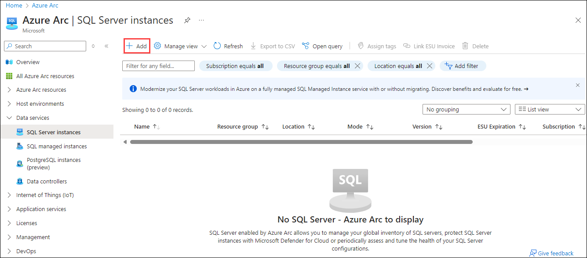
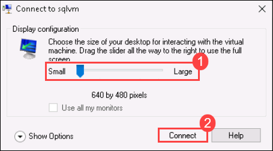

# Exercise 3: Onboard SQL Server to Arc
### Estimated Duration: 30 Minutes
## Overview 

In the last exercise, you have seen how to enable security measures and monitoring for Arc-enabled servers. In this exercise, you will onboard SQL Server to Azure Arc using Azure Portal and PowerShell commands.

## Objectives

In this exercise, you will be performing the following tasks:

- Task 01: Login To Azure Portal
- Task 02: Register Azure Arc-enabled SQL Server.
- Task 03: Run on-demand SQL Assessment.

## Task 1: Login To Azure Portal

1. Navigate back to Azure Portal which you have already opened in the previous exercises.
      
1. Click on the search blade at the top and search for ``SQL Server - Azure Arc`` **(1)**, select **SQL Server - Azure Arc (2)**.
 
   
   
1. Click on the **Add** button to create the **SQL Server- Azure Arc**. 
 
   
   
1. In the Adding existing SQL Servers instances page, Click on **Connect Servers**.

   
   
1. You will now see the prerequisite page. You can explore the page and then click on the **Next: Server details** option.
    
   > **Note**: We have already completed the prerequisite part for you. 
    
   
   
1. On the **Server Details** blade, enter the below details.
 
   - Subscription: Leave default **(1)**

   - Resource group: Select **azure-arc (2)** from dropdown list.

   - Region: Select the same region as the Resource group. **(3)**

   - Operating Systems: Select **Windows (4)**.

   - Server Name: Type **sqlvm (5)**

   - License Type: Select **I have a production environment on this server with Enterprise or Standard edition covered by Software Assurance or SQL subscription ("Paid") (6)**.

     Now, click on the **Next: Tags (7)** button.
   
      
   
1. Leave the default for tags blade and click on **Next: Run Script** button.
 
1. On the **Script** blade, explore the given script. We will be using this PowerShell script to **Register Azure Arc enabled SQL Server** later.
 
   > **Note**: Please **skip the script download** from here by clicking on ``X`` at the top right as we have **already downloaded** this script inside the Lab VM for you.
    
   
     
## Task 2: Register Azure Arc-enabled SQL Server.

1. Minimize the Azure Portal Browser window. 

1. From the desktop of your **LabVM/ARCHost VM**, double click on **Windows PowerShell** icon to open it.
 
   
  
1. Then, run the below command to change the directory to where the script gets downloaded.
 
   ``` 
   cd C:\LabFiles
   ```

1. After changing the directory to **Lab files**, run the command given below:

   ```
   .\Execute-RegisterSqlServerArc.ps1 
   ```
   > **Note** : If the above command fails, Navigate to the sqlvm within the Hyper-V manager and ensure it is in runnning state, If it is in Off state right click on the Vm and then select start. Once the sqlvm has started wait for some time and re-run the command again if you encounter any warnings or Errors that can be ignored.
    
   > **Note** : This will initiate the execution of **RegisterSqlServerArc.ps1** script inside **sqlvm** that is deployed on Hyper-V.

1. After running the command, you will see that the script started running.

   
  
1. After some time, you will see that the script execution is completed. Make sure that you see the output as shown the image below.

    
  
1. Bring back the browser window where you had opened Azure Portal and search for **SQL Server -Azure Arc**. If you are already on that page, you will need to click on the Refresh button. On that page, you will see one resource **SQLVM** that we just created using the PowerShell script in the previous step.

   

   > **Note** : Please wait for 2-3 minutes until the Mode turns from **Registered** to **Connected** state.
  
1. Select the **SQLVM** resource and now you can see the dashboard of **SQLVM** SQL Server -Azure Arc from Azure Portal.

   

## Task 3: Run on-demand SQL Assessment.

1. Click on the search blade at the top and search for ```Log Analytics workspace```. 

   
   
1. Select **LogAnalyticsWS-<inject key="DeploymentID/Suffix" />**.
   
   
   
1. Then select **Agents (1)** under **Settings** from the left side menu. Click on **Log Analytics agent instructions (2)** and copy the value of **Workspace ID (3)** and **Primary Key (4)** and save it into a Notepad or Notepad++ for later use.
 
   

1. Now, search for **Machines - Azure Arc** from search box and click on **Machines - Azure Arc**.
 
    
   
1. Select **sqlvm** from the list of Azure Arc servers.

   
    
1. Click on the **Extension** button under **Settings** from the left side menu.
 
   
    
1. Click on the **+ Add** button to add a new extension.

   

1. Search and select the **Log Analytics Agent - Azure Arc (1)(2)** extension and click on the **Next (3)** button to continue.
 
       
   
1. At this step, you must enter the Log Analytics workspace ID and a key to install the MMA ( Microsoft Monitoring Agent ) in the **sqlvm**.
  
1. Now, enter the **Workspace ID (1)** and **Key (2)** that you copied from the previous step, click on **Review + Create (3)** button.
 
   

1. Review the configuration, and click on **Create**.

   

   > **Note**: The deployment will take around 5 to 10 minutes to complete. You have to wait for this deployment to be successful to proceed to the next step.
   
1. Open **sqlvm** from the Hyper-V Manager by double clicking on **sqlvm**.

   

1. On Connect to sqlvm box, scroll the bar towards **Small (1)** to open the VM in the smallest window and then click on the **Connect (2)** button.

   

1. Type password **demo@pass123** and press **Enter** button to login. Then, you can resize the sqlvm window size at your convenience.
   
   

1. Click on Start Menu and search for **Microsoft SQL Server Management Studio 18** and open it.
   
   
  
1. On **Connect to server** pop-up, select **SQLVM** as Server name from drop-down and click on **Connect**.

   
   
1. In the left pane, expand **Security** then **Logins**. In Logins, right-click on **NT AUTHORITY\SYSTEM** and click on **Properties**.

   
  
1. In Login Properties pane, click on **Server Roles** then enable the **sysadmin** role and click on **Ok**.

   
 
1. Then, Go to **SQLVM** SQL Server - Azure Arc resource select the **Best practices assessment (1)** under settings from the left pane and click on **Change license type (2)**.
   
   > **Note**: Skip and continue from **Step 20** if **change license type** option is not available.
   
   

1. Under **SQL Server Configuration**, scroll down and select license type as **License with Software Assurance (1)** and click on **Save (2)**.

   

1. Select the log Analytics Workspace as **LogAnalyticsWS-<inject key="DeploymentID" enableCopy="false" /> (1)** from the drop-down and click on **Enable assessment (2)**.

   
   
   > **Note**: After enabling the assessment, wait for a few minutes to get it complete. 
   
1. Once the assessment is **completed**, click on it to see the results. The **Assessment results** will look like below:

    
      
   > **Note**: Now you can move to the next Exercise, you don't have to wait here for the Result to appear.   

   > **Congratulations** on completing the task! Now, it's time to validate it. Here are the steps:
 
   - Hit the Validate button for the corresponding task. If you receive a success message, you can proceed to the next task.
   - If not, carefully read the error message and retry the step, following the instructions in the lab guide.
   - If you need any assistance, please contact us at labs-support@spektrasystems.com. We are available 24/7 to help you out.
 
<validation step="e9c36253-2523-4964-9996-0b518f38ee52" />

## Summary 

In this exercise, you registered an Azure Arc-enabled SQL Server, enabling centralized management and monitoring of SQL resources. You also performed an on-demand SQL Assessment to evaluate the server's configuration, identify potential issues, and receive recommendations for optimization and best practices.

###  You have successfully completed the lab.
